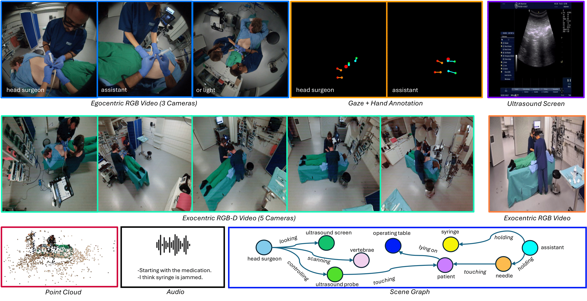

# EgoExOR: An Egocentric–Exocentric Operating Room Dataset for Comprehensive Understanding of Surgical Activities
<table>
  <tr>
    <td style="padding: 0;">
      <a href="https://huggingface.co/datasets/ardamamur/EgoExOR">
        
      </a>
    </td>
    <td style="padding: 0;">
      <a href="https://github.com/ardamamur/EgoExOR">
        
      </a>
    </td>
    <td style="padding: 0;">
      <a href="https://huggingface.co/ardamamur/EgoExOR">
        
      </a>
    </td>
  </tr>
</table>

Official code of the paper "EgoExOR: An Egocentric–Exocentric Operating Room Dataset for Comprehensive Understanding of Surgical Activities" submitted at NeurIPS 2025 Datasets & Benchmarks Track.

- **Authors**: [Ege Özsoy][eo], [Arda Mamur][am], Felix Tristram, Chantal Pellegrini, Magdalena Wysocki, Benjamin Busam, [Nassir Navab][nassir]

Operating rooms (ORs) demand precise coordination among surgeons, nurses, and equipment in a fast-paced, occlusion-heavy environment, necessitating advanced perception models to enhance safety and efficiency. Existing datasets either provide partial egocentric views or sparse exocentric multi-view context, but don't explore the comprehensive combination of both. We introduce EgoExOR, the first OR dataset and accompanying benchmark to fuse first-person and third-person perspectives. Spanning 94 minutes (84,553 frames at 15 FPS) of two simulated spine procedures, Ultrasound-Guided Needle Insertion and Minimally Invasive Spine Surgery, EgoExOR integrates egocentric data (RGB, gaze, hand tracking, audio) from wearable glasses, exocentric RGB and depth from RGB-D cameras, and ultrasound imagery. Its detailed scene graph annotations, covering 36 entities and 22 relations (~573,000 triplets), enable robust modeling of clinical interactions, supporting tasks like action recognition and human-centric perception. We evaluate the surgical scene graph generation performance of two adapted state-of-the-art models and offer a new baseline that explicitly leverages EgoExOR’s multimodal and multi-perspective signals. Our new dataset and benchmark set a new foundation for OR perception, offering a rich, multimodal resource for next-generation clinical perception. 


[am]: https://github.com/ardamamur/
[eo]: https://www.cs.cit.tum.de/camp/members/ege-oezsoy/
[nassir]: https://www.cs.cit.tum.de/camp/members/cv-nassir-navab/nassir-navab/

<p align="center">
  
</p>
<p align="center">
  <em>Figure: Overview of one timepoint from the EgoExoR  dataset, showcasing synchronized multi-view egocentric RGB and exocentric RGB-D video streams, live ultrasound monitor feed,  audio, a fused 3D point-cloud reconstruction, and gaze, hand‐pose and scene graph annotations.</em>
</p>


## EgoExOR Dataset

The **EgoExOR** dataset is hosted on [Hugging Face](https://huggingface.co/datasets/ardamamur/EgoExOR). It provides a rich collection of multimodal simulated surgical procedure data, including synchronized RGB video, audio, eye-gaze, hand-tracking, 3D point clouds, and scene-graph annotations. For detailed information on dataset structure, modalities, and usage instructions, please refer to the comprehensive guidelines in [`data/README.md`](data/README.md).

## Scene Graph Generation
This part of the repository contains the code for training and evaluating scene graph generation models.
This section builds upon the MM-OR (https://github.com/egeozsoy/MM-OR) and LLava (https://github.com/haotian-liu/LLaVA) repositories.

To fully EgoExOR’s multi-perspective data, we propose a new baseline model with two distinct branches, as shown in figure below. The egocentric branch processes first-person RGB, hand pose, and gaze data, while the exocentric branch handles third-person RGB-D, ultrasound screen recordings, audio, and point clouds. Each branch employs a 2-layer transformer to fuse its inputs into a fixed sized representation of $N$ tokens. These representations are then concatenated to form the input for the LLM, integrating insights from both perspectives. Unlike ORacle and MM2SG, this dual-branch architecture explicitly separates and fuses egocentric and exocentric signals, enhancing the modeling of parallel actions and staff interactions.

<p align="center">
  
</p>
<p align="center">
  <em>Figure: Overview of the proposed holistic operating-room modeling framework.</em>
</p>


### 🌟 Installation
* `Run pip install -r requirements.txt`. You might need to comment out the `rerun-sdk` line, and install it manually afterwards with conda-forge. Since it is a [known issue](https://github.com/rerun-io/rerun/issues/1320), it might not work with the pip installation. 
- Download the dataset from under the guidence of [`data/README.md`](data/README.md)
    * https://huggingface.co/datasets/ardamamur/EgoExOR
- Merge all h5 files into a single one. [`data/README.md`](data/README.md)
  ```python
  python -m data.utils.merge_h5 \
    --data_dir /path/to/dataset/root_dir/ \
    --input_files miss_1.h5 miss_2.h5 miss_3.h5 miss_4.h5 ultrasound_1.h5 ultrasound_2.h5 ultrasound_3.h5 ultrasound_4.h5 ultrasound_5_14.h5 ultrasound_5_58.h5 \
    --splits_file splits.h5 \
    --output_file egoexor.h5 \
  ``` 
- cd into scene_graph_generation dir
- Locally install llava by going into LLaVa folder and running `pip install -e .`
- Potentially you need to explicitly install flash-attn like `pip install flash-attn --no-build-isolation`
- Install the correct spconv version for pointtransformers by running `pip install spconv-cu117`. Make sure to install the correct version for your CUDA version.
- Sometimes it might be necessary to force install the correct numpy version `pip install numpy==1.26.4`
- Install torch_scatter by following the direction at: https://github.com/rusty1s/pytorch_scatter. If using conda/miniconda it can be as simple as `conda install pytorch-scatter -c pyg`

### ⚙️ Training
- For the training, we first need to generate the training json. To this end run `python -m scene_graph_prediction.llava_helpers.generate_dataset_format_for_llava --hdf5_path "egoexor.h5" --dataset_name egoexor`. Reading through this script is suggested, it has some parameters for adjusting number of samples via N_PEM etc controlled via config file [`egoexor.json`](scene_graph_generation/scene_graph_prediction/scene_graph_helpers/configs/egoexor.json)
- Now with the training json ready, we can proceed to training. cd into the LLaVA folder and run:
```python
python -m llava.train.train_mem \
  --lora_enable True \
  --bits 4 \
  --lora_r 128 \
  --lora_alpha 256 \
  --mm_projector_lr 2e-5 \
  --model_name_or_path liuhaotian/llava-v1.5-7b \
  --version v1 \
  --dataset_name egoexor \
  --data_path ../data/llava_samples/train_4perm_Falsetemp_Falsetempaug_EgoExOR_drophistory0.5.json \
  --hdf5_path /path/to/egoexor.h5/ \
  --token_weight_path ../data/llava_samples/train_token_freqs_7b_4perm_EgoExOR.json \
  --vision_tower openai/clip-vit-large-patch14-336 \
  --mm_projector_type mlp2x_gelu \
  --mm_vision_select_layer -2 \
  --mm_use_im_start_end False \
  --mm_use_im_patch_token False \
  --image_aspect_ratio pad \
  --group_by_modality_length True \
  --bf16 True \
  --output_dir ./checkpoints/llava-v1.5-7b-task-lora_hybridor_qlora_4perm_EgoExOR \
  --num_train_epochs 1 \
  --per_device_train_batch_size 2 \
  --per_device_eval_batch_size 2 \
  --gradient_accumulation_steps 8 \
  --evaluation_strategy "no" \
  --save_strategy "steps" \
  --save_steps 1 \
  --learning_rate 2e-5 \
  --max_grad_norm 0.1 \
  --weight_decay 0. \
  --warmup_ratio 0.03 \
  --lr_scheduler_type "cosine" \
  --logging_steps 1 \
  --tf32 True \
  --model_max_length 2048 \
  --gradient_checkpointing True \
  --dataloader_num_workers 4 \
  --lazy_preprocess True \
  --report_to wandb \
  --run_name llava-v1.5-7b-task-lora_hybridor_qlora_4perm_EgoExOR \
  --mv_type "learned" \
  --unfreeze_n_vision_tower_layers 12 \
  --multimodal_drop_prop 0.50 \
  --do_augment False
```

### 🚀 Evaluation

🔗 **Pretrained Model**  
The pretrained foundation model for EgoExOR is available on Hugging Face:  
👉 [EgoExOR Hugging Face Model](https://huggingface.co/ardamamur/EgoExOR)

📦 **Setup**  
1. Download the zipped model file from the link above.  
2. Unzip the file to extract the model checkpoint and configuration.  
3. Download the test sample JSON file from the model repository.
4. Adjust the `data_dir` and `hdf5_path` via config file [`egoexor.json`](scene_graph_generation/scene_graph_prediction/scene_graph_helpers/configs/egoexor.json) if not already. 

🧪 **Run Evaluation**  
Use the following command to evaluate the EgoExOR model on your data:

```bash
python -m scene_graph_prediction.main \
    --config "egoexor.json" \
    --model_path "path/to/model" \
    --data_path "path/to/data_samples" \
    --benchmark_on "egoexor" \
    --mode "infer"
